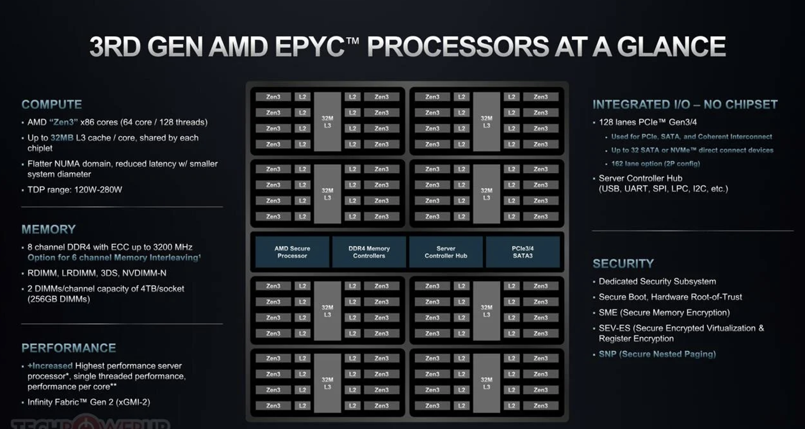

# CCX Scheduling（中文）
- AMD在ZEN架构中引入了CCD/CCX的概念，其中有一个很大的不同是LLC不再由socket的核心共享，而是由CCX的核心共享。当前kubelet是没有感知CCX这一层的概念的，然而LLC的命中率对应用性能有着较大的影响，我们计划引入CCX感知调度提升其性能。
## Table of Contents
<!-- TOC -->

- [CCX Scheduling（中文）](#ccx-scheduling%E4%B8%AD%E6%96%87)
    - [Table of Contents](#table-of-contents)
    - [Motivation](#motivation)
        - [Goals](#goals)
        - [Non-Goals](#non-goals)
    - [Proposal](#proposal)
        - [User Stories](#user-stories)
        - [Proposed Change](#proposed-change)
        - [获取CCX拓扑情况](#%E8%8E%B7%E5%8F%96ccx%E6%8B%93%E6%89%91%E6%83%85%E5%86%B5)
        - [CPUSET重排](#cpuset%E9%87%8D%E6%8E%92)
        - [CPUSET分配策略with CCX](#cpuset%E5%88%86%E9%85%8D%E7%AD%96%E7%95%A5with-ccx)
        - [amd-milan架构图](#amd-milan%E6%9E%B6%E6%9E%84%E5%9B%BE)

<!-- /TOC -->

## Motivation
当前的cpu分配策略（无论是kubelet还是crane-agent）都没有考虑CCX的拓扑情况的，因此可能会出现服务跨LLC运行的现象，这无疑会减少LLC的命中率并且增加多线程之间的通信成本。
### Goals
- crane-agent感知CCX的拓扑，在分配的时候尽可能让container运行在更少的LLC上。
### Non-Goals
- crane-agent只做Best-Effort实现,如果要确保服务运行在最少的LLC上，需要在调度器上实现额外的插件。

## Proposal
### User Stories
- 在使用amd机器的混部场景，可以通过CCX感知调度减少应用间的干扰，提升应用性能
- 在使用amd机器的在离线潮汐混部场景，可以让离线独占l3cache，从而减少在离线之间的干扰
### Proposed Change
我们计划在crane-agent增加一个feature-gate:CCX-Scheduling，这将会影响crane-agent的cpuset-managet组件的以下行为：
1. 在启动时会获取CCX的拓扑分布，作为CPUTopology的组成部分
2. 在为container分配cpusets的时候会加入对CCX的考虑
3. 会定时对已经分配cpuset的container进行重排
这样，我们就做到尽可能让container运行在更少的LLC上了。

### 获取CCX拓扑情况
根据AMD的定义，CCX（Core Complex）是指Zen的基本组成单位，里面的核心将共享LLC。根据定义所以我们可以通过`/cache/index3/shared_cpu_list`可以获取到拓扑信息。
同时增加结构：
```
type CCDTopology struct {
    NumCCDs int
    CPUCCDDetails CPUDetails
}
type CPUTopology struct {
    *topology.CPUTopology
    *CCDTopology
}
```

### CPUSET重排
考虑到在NUMA-NODE内修改CPUSET并不会出现内存的迁移，重排操作略重于cpu的负载均衡，并且重排行为仅发生在pod增减修改的场景，频率可控。
因此会定时对CPUSET进行重排以获得更好的CCX感知调度效果。重排的时候会对container进行排序，排序高的container优先满足LLC需求, 具体排序策略如下：
1. REQ-CPU mod CCX-Size == 0 优先
2. pod的优先级
3. REQ-CPU mod CCX-Size

考虑到重排的中间态会有overlap，如果中间程序退出可能导致不可预料的结果，因此重排前会解除cpuset的绑定关系，然后对所有的container进行重绑定。
当前未发现这个重绑定行为会造成肉眼可见的影响，如果有必要的话，这边也可以对重排做一个最小步骤迁移计划的步骤优化。

### CPUSET分配策略with CCX
在CPUSET分配策略的freeCores逻辑中加入判断：
1. 优先分配整CCX
2. CCX分配出去后剩余cores越少越优先
3. CCX分配出去后仍缺少的cores越少越优先

考虑到这个算法可能到应用到调度器的插件中，所以不适合使用特别复杂的逻辑，因此整体使用贪心策略实现

### amd-milan架构图

